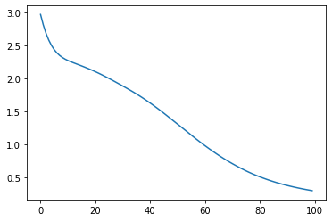
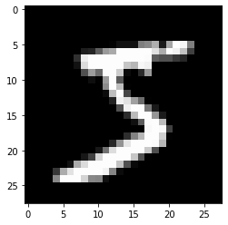
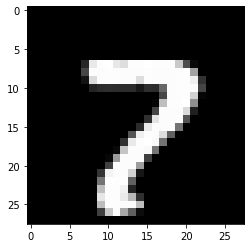

## XOR problem

### 1. Single Perceptron with PyTorch


```python
import torch
import torch.nn as nn
import torch.nn.functional as F
import torch.optim as optim

device = 'cuda' if torch.cuda.is_available() else 'cpu'
if device == 'cuda':
    torch.cuda.manual_seed_all(777)

    
X = torch.FloatTensor([[0,0],[0,1],[1,0],[1,1]]).to(device)
Y = torch.FloatTensor([[0],[1],[1],[0]]).to(device)

# single perceptron with a neuron.
linear = nn.Linear(2,1, bias=True)
sigmoid = nn.Sigmoid()
model = nn.Sequential(linear, sigmoid).to(device)

# costfunction and optimizer
criterion = torch.nn.BCELoss().to(device)  # BCE = Binary Class Entropy (이진 분류에 쓰이는 엔트로피)
optimizer = torch.optim.SGD(model.parameters(), lr=1)

#10,001 epochs
for step in range(10001):
    optimizer.zero_grad()
    hypothesis = model(X)
    
    #cost function
    cost = criterion(hypothesis, Y)
    cost.backward()
    optimizer.step()
    
    if step % 100 == 0: #100번째 epoch마다 cost 출력
        print(step, cost.item())

```

    0 0.7095224857330322
    100 0.6931524276733398
    200 0.6931471824645996
    300 0.6931471824645996
    400 0.6931471824645996
    500 0.6931471824645996
    600 0.6931471824645996
    700 0.6931471824645996
    800 0.6931471824645996
    900 0.6931471824645996
    1000 0.6931471824645996
    1100 0.6931471824645996
    1200 0.6931471824645996
    1300 0.6931471824645996
    1400 0.6931471824645996
    1500 0.6931471824645996
    1600 0.6931471824645996
    1700 0.6931471824645996
    1800 0.6931471824645996
    1900 0.6931471824645996
    2000 0.6931471824645996
    2100 0.6931471824645996
    2200 0.6931471824645996
    2300 0.6931471824645996
    2400 0.6931471824645996
    2500 0.6931471824645996
    2600 0.6931471824645996
    2700 0.6931471824645996
    2800 0.6931471824645996
    2900 0.6931471824645996
    3000 0.6931471824645996
    3100 0.6931471824645996
    3200 0.6931471824645996
    3300 0.6931471824645996
    3400 0.6931471824645996
    3500 0.6931471824645996
    3600 0.6931471824645996
    3700 0.6931471824645996
    3800 0.6931471824645996
    3900 0.6931471824645996
    4000 0.6931471824645996
    4100 0.6931471824645996
    4200 0.6931471824645996
    4300 0.6931471824645996
    4400 0.6931471824645996
    4500 0.6931471824645996
    4600 0.6931471824645996
    4700 0.6931471824645996
    4800 0.6931471824645996
    4900 0.6931471824645996
    5000 0.6931471824645996
    5100 0.6931471824645996
    5200 0.6931471824645996
    5300 0.6931471824645996
    5400 0.6931471824645996
    5500 0.6931471824645996
    5600 0.6931471824645996
    5700 0.6931471824645996
    5800 0.6931471824645996
    5900 0.6931471824645996
    6000 0.6931471824645996
    6100 0.6931471824645996
    6200 0.6931471824645996
    6300 0.6931471824645996
    6400 0.6931471824645996
    6500 0.6931471824645996
    6600 0.6931471824645996
    6700 0.6931471824645996
    6800 0.6931471824645996
    6900 0.6931471824645996
    7000 0.6931471824645996
    7100 0.6931471824645996
    7200 0.6931471824645996
    7300 0.6931471824645996
    7400 0.6931471824645996
    7500 0.6931471824645996
    7600 0.6931471824645996
    7700 0.6931471824645996
    7800 0.6931471824645996
    7900 0.6931471824645996
    8000 0.6931471824645996
    8100 0.6931471824645996
    8200 0.6931471824645996
    8300 0.6931471824645996
    8400 0.6931471824645996
    8500 0.6931471824645996
    8600 0.6931471824645996
    8700 0.6931471824645996
    8800 0.6931471824645996
    8900 0.6931471824645996
    9000 0.6931471824645996
    9100 0.6931471824645996
    9200 0.6931471824645996
    9300 0.6931471824645996
    9400 0.6931471824645996
    9500 0.6931471824645996
    9600 0.6931471824645996
    9700 0.6931471824645996
    9800 0.6931471824645996
    9900 0.6931471824645996
    10000 0.6931471824645996
    

### 2. Check prediction


```python
with torch.no_grad():
    hypothesis = model(X)
    predicted = (hypothesis > 0.5).float()
    accuracy = (predicted == Y).float().mean()
    print('모델출력값: ', hypothesis.detach().cpu().numpy())
    print('모델예측값: ', predicted.detach().cpu().numpy())
    print('실제값: ', Y.detach().cpu().numpy())
    print('정확도: ', accuracy.detach().cpu().numpy())
    
    
```

    모델출력값:  [[0.5]
     [0.5]
     [0.5]
     [0.5]]
    모델예측값:  [[0.]
     [0.]
     [0.]
     [0.]]
    실제값:  [[0.]
     [1.]
     [1.]
     [0.]]
    정확도:  0.5
    

## XOR problem - Multi layer perceptron


```python
import torch
import torch.nn as nn
import torch.nn.functional as F
import torch.optim as optim

device = 'cuda' if torch.cuda.is_available() else 'cpu'
if device=='cuda':
    torch.cuda.manual_seed_all(777)

X = torch.FloatTensor([[0,0],[0,1],[1,0],[1,1]]).to(device)
Y = torch.FloatTensor([[0],[1],[1],[0]]).to(device)

model = nn.Sequential(
            nn.Linear(2,10, bias=True),
            nn.Sigmoid(),
            nn.Linear(10,10, bias=True),
            nn.Sigmoid(),
            nn.Linear(10,10, bias=True),
            nn.Sigmoid(),
            nn.Linear(10,1, bias=True),
            nn.Sigmoid()
).to(device)

```


```python
# cost function and optimizer
criterion = nn.BCELoss().to(device)
optimizer = torch.optim.SGD(model.parameters(), lr=0.4)

for epoch in range(10001):
    optimizer.zero_grad()
    
    #forward prop
    hypothesis = model(X)
    
    # cost
    cost = criterion(hypothesis, Y)
    cost.backward()
    optimizer.step()
    
    #print training process
    if epoch % 100 == 0:
        print(epoch, cost.item())
    
    
```

    0 0.7095606327056885
    100 0.6931450366973877
    200 0.6931437849998474
    300 0.6931425333023071
    400 0.6931412816047668
    500 0.6931400299072266
    600 0.6931387186050415
    700 0.6931374073028564
    800 0.6931360960006714
    900 0.6931347250938416
    1000 0.6931332945823669
    1100 0.6931319236755371
    1200 0.6931304931640625
    1300 0.6931290626525879
    1400 0.6931275725364685
    1500 0.6931260824203491
    1600 0.6931245923042297
    1700 0.6931229829788208
    1800 0.6931213140487671
    1900 0.6931195855140686
    2000 0.6931178569793701
    2100 0.6931161284446716
    2200 0.6931142210960388
    2300 0.693112313747406
    2400 0.6931103467941284
    2500 0.693108320236206
    2600 0.6931061744689941
    2700 0.6931038498878479
    2800 0.6931015253067017
    2900 0.6930992007255554
    3000 0.6930966377258301
    3100 0.69309401512146
    3200 0.6930912137031555
    3300 0.6930882930755615
    3400 0.6930851936340332
    3500 0.6930820941925049
    3600 0.6930786371231079
    3700 0.6930750608444214
    3800 0.6930712461471558
    3900 0.6930673122406006
    4000 0.6930630207061768
    4100 0.6930584907531738
    4200 0.6930537223815918
    4300 0.6930484771728516
    4400 0.6930429935455322
    4500 0.6930371522903442
    4600 0.6930308938026428
    4700 0.6930240392684937
    4800 0.693016767501831
    4900 0.6930088400840759
    5000 0.693000316619873
    5100 0.6929910182952881
    5200 0.6929808855056763
    5300 0.6929698586463928
    5400 0.6929577589035034
    5500 0.6929444074630737
    5600 0.692929744720459
    5700 0.6929134130477905
    5800 0.6928954124450684
    5900 0.6928752660751343
    6000 0.6928524971008301
    6100 0.692827045917511
    6200 0.6927981376647949
    6300 0.6927650570869446
    6400 0.6927272081375122
    6500 0.6926833987236023
    6600 0.6926323175430298
    6700 0.6925721168518066
    6800 0.6925007700920105
    6900 0.6924149990081787
    7000 0.6923105716705322
    7100 0.6921816468238831
    7200 0.6920198202133179
    7300 0.6918126344680786
    7400 0.691541314125061
    7500 0.6911761164665222
    7600 0.6906682848930359
    7700 0.6899331212043762
    7800 0.6888141632080078
    7900 0.6869990825653076
    8000 0.6838053464889526
    8100 0.6775776147842407
    8200 0.6639736294746399
    8300 0.6329092979431152
    8400 0.5785868167877197
    8500 0.5208621621131897
    8600 0.3928997814655304
    8700 0.08463142812252045
    8800 0.02723478153347969
    8900 0.014161456376314163
    9000 0.009122522547841072
    9100 0.006579084787517786
    9200 0.005080556496977806
    9300 0.004105682484805584
    9400 0.003426555311307311
    9500 0.002929226029664278
    9600 0.0025508359540253878
    9700 0.0022541936486959457
    9800 0.002015931298956275
    9900 0.0018207947723567486
    10000 0.0016582502285018563
    


```python
with torch.no_grad():
    hypothesis = model(X)
    predicted = (hypothesis > 0.5).float()
    accuracy = (predicted == Y).float().mean()
    print('모델의 출력값(Hypothesis): ', hypothesis.detach().cpu().numpy())
    print('모델의 예측값(Predicted): ', predicted.detach().cpu().numpy())
    print('실제값(Y): ', Y.cpu().numpy())
    print('정확도(Accuracy): ', accuracy.item())
```

    모델의 출력값(Hypothesis):  [[5.2062715e-05]
     [9.9993372e-01]
     [9.9994230e-01]
     [9.5483265e-05]]
    모델의 예측값(Predicted):  [[0.]
     [1.]
     [1.]
     [0.]]
    실제값(Y):  [[0.]
     [1.]
     [1.]
     [0.]]
    정확도(Accuracy):  1.0
    

## Classification of Hand-written number by MLP

Dataset : load_digit (1797 samples)  
size : 8 * 8   
label : 0 ~ 9  
brightness : 0 ~ 15  


```python
import torch
import torch.nn as nn
import torch.nn.functional as F
import torch.optim as optim
from matplotlib import pyplot as plt
from sklearn.datasets import load_digits
digits = load_digits()

device = 'cuda' if torch.cuda.is_available() else 'cpu'
if device == 'cuda':
    torch.cuda.manual_seed_all(777)

# size check
print(digits.images.shape)

# sample figure check
plt.axis('off')
plt.imshow(digits.images[0], cmap=plt.cm.gray_r, interpolation='nearest')

X = torch.FloatTensor(digits.data).to(device)    #(1797,64)
Y = torch.LongTensor(digits.target).to(device)  #(1797,1)
```

    (1797, 8, 8)
    


    

    


```python
model = nn.Sequential(
        nn.Linear(64, 32),
        nn.ReLU(),
        nn.Linear(32,16),
        nn.ReLU(),
        nn.Linear(16,10),
        ).to(device)

criterion = nn.CrossEntropyLoss()
optimizer = optim.Adam(model.parameters())
losses = []

for epoch in range(100):
        
    #hypothesis
    hypothesis = model(X)
    
    #cost
    optimizer.zero_grad()
    cost = criterion(hypothesis, Y)
    cost.backward()
    optimizer.step()
    
    if epoch % 10 == 0:
        print(epoch, cost.item())
    
    losses.append(cost.item())

plt.plot(losses)
```

    0 2.969242572784424
    10 2.271925210952759
    20 2.1025967597961426
    30 1.8856620788574219
    40 1.6271921396255493
    50 1.3075491189956665
    60 0.9810643196105957
    70 0.7087021470069885
    80 0.5102044939994812
    90 0.37973830103874207
    


    [<matplotlib.lines.Line2D at 0x25c284efd90>]


    

    


## MNIST Classification by MLP


```python
import numpy as np
import matplotlib.pyplot as plt
from sklearn.datasets import fetch_openml
mnist = fetch_openml('mnist_784', version=1, cache=True)

```


```python
import torch
from torch.utils.data import TensorDataset, DataLoader
from sklearn.model_selection import train_test_split

# sample check
plt.imshow(mnist.data.values[0].reshape(28,28), cmap='gray')

#dataset 
X = mnist.data.values / 255  # 0~1 normalization
mnist.target = mnist.target.astype(np.int8)  #convert type to extract only values
Y = mnist.target.values

#Training and test set 
X_train, X_test, Y_train, Y_test = train_test_split(X,Y,test_size=1/7, random_state=0)
X_train = torch.Tensor(X_train).to(device)
X_test = torch.Tensor(X_test).to(device)
Y_train = torch.LongTensor(Y_train).to(device)
Y_test = torch.LongTensor(Y_test).to(device)

ds_train = TensorDataset(X_train, Y_train)
ds_test = TensorDataset(X_test, Y_test)

loader_train = DataLoader(ds_train, batch_size=64, shuffle=True)
loader_test = DataLoader(ds_test, batch_size=64, shuffle=False)
```


    

    


```python
import torch
import torch.nn as nn
import torch.nn.functional as F
import torch.optim as optim

device = 'cuda' if torch.cuda.is_available() else 'cpu'
if device == 'cuda':
    torch.cuda.manual_seed_all(777)
    

# Model 
model = nn.Sequential(
        nn.Linear(784,100),
        nn.ReLU(),
        nn.Linear(100,100),
        nn.ReLU(),
        nn.Linear(100,10),
        ).to(device)

#loss function
loss_fn = nn.CrossEntropyLoss()

#optimizer
optimizer = optim.Adam(model.parameters())

def train(epoch):
    model.train() #신경망을 학습모드로 전환
    
    #데이터로더에서 미니배치를 하나씩 꺼내서 학습 수행
    for data, targets in loader_train:
        
        optimizer.zero_grad() #경사를 0으로 초기화
        outputs = model(data)   #데이터 입력 후 출력 계산
        loss = loss_fn(outputs, targets) #출력과 훈련 데이터 정답 간의 오차 계산
        loss.backward()
        optimizer.step()
        
    print("epoch{}: 완료\n".format(epoch))
    
    
def test():
    model.eval() #신경망을 추론 모드로 전환
    correct = 0
    
    #데이터로더에서 미니배치를 하나씩 꺼내 추론을 수행
    with torch.no_grad():
        for data, targets in loader_test:
            
            outputs = model(data) #데이터 입력 후 출력 계산
            
            #추론 계산
            _, predicted = torch.max(outputs.data,1) #확률이 가장 높은 레이블이 무엇인지 계산
            #여기서 첫번째 차원의 _, 는 첫번째 차원은 굳이 받지 않겠다는 의미. 2번째 차원인 predicted만 받아옴.
            
            correct += predicted.eq(targets.data.view_as(predicted)).sum() # 정답과 일치한 경우 카운트 증가
    
    #정확도 출력
    data_num = len(loader_test.dataset) #데이터 총 건수
    print('\n테스트 데이터에서 예측 정확도: {}/{} ({:.0f}%)\n'.format(correct, data_num, 100. * correct / data_num))

for epoch in range(20):
    train(epoch)
test()

```

    epoch0: 완료
    
    epoch1: 완료
    
    epoch2: 완료
    
    epoch3: 완료
    
    epoch4: 완료
    
    epoch5: 완료
    
    epoch6: 완료
    
    epoch7: 완료
    
    epoch8: 완료
    
    epoch9: 완료
    
    epoch10: 완료
    
    epoch11: 완료
    
    epoch12: 완료
    
    epoch13: 완료
    
    epoch14: 완료
    
    epoch15: 완료
    
    epoch16: 완료
    
    epoch17: 완료
    
    epoch18: 완료
    
    epoch19: 완료
    
    
    테스트 데이터에서 예측 정확도: 9736/10000 (97%)
    
    


```python
# Test check

index = 2023

model.eval() #테스트모드로 전환
data = X_test[index]
output = model(data)

_, predict = torch.max(output.data,0)

print("Predict : {}".format(predict))


X_test_show = (X_test[index].cpu()).numpy()
print("Answer : {}".format(Y_test[index]))
plt.imshow(X_test_show.reshape(-1,28), cmap='gray')

```

    Predict : 7
    Answer : 7
    


    <matplotlib.image.AxesImage at 0x25c2beee670>


    

    


```python

```
